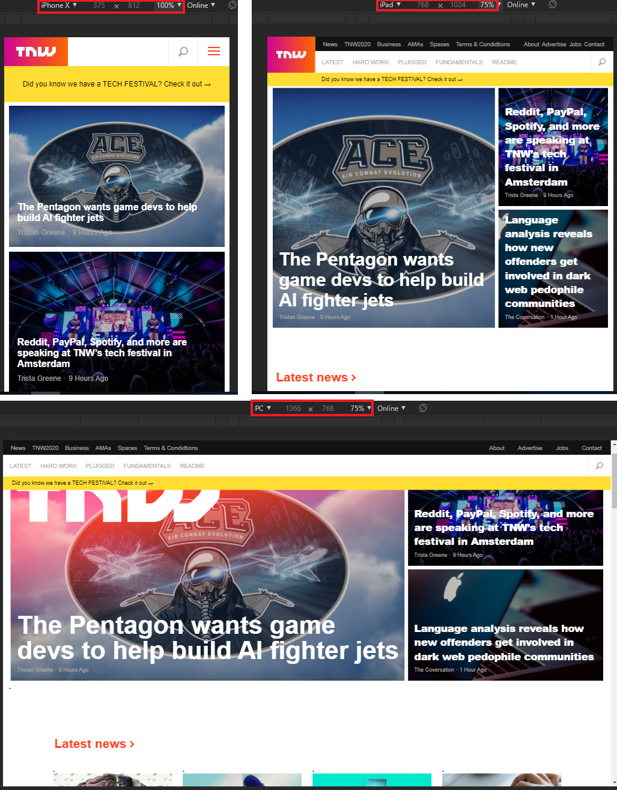

@@ -1 +1,90 @@
# cloning-thenextweb
<h3 align="center">Responsive Design Project</h3>

<div align="center">

[](https://raw.githack.com/alishabab/cloning-thenextweb/feature/index.html)
[](https://github.com/alishabab/cloning-thenextweb/issues)
[](https://github.com/alishabab/cloning-thenextweb/pulls)
[](https://github.com/kevinfrontend)
&
[](https://github.com/alishabab)
[](/LICENSE)

</div>

---

## 📝 Content
<p align="center">
<a href="#about">About</a>&nbsp;&nbsp;&nbsp;|&nbsp;&nbsp;&nbsp;
<a href="#installing">Installing</a>&nbsp;&nbsp;&nbsp;|&nbsp;&nbsp;&nbsp;
<a href="#built_using">Built with</a>&nbsp;&nbsp;&nbsp;|&nbsp;&nbsp;&nbsp;
<a href="#authors">Authors</a>
</p>


## 🧐 About <a name = "about"></a>
<h3 align="center"> This is an assigment for Microverse's HTML and CSS course, and the goal is to clone the TNW <a href="https://thenextweb.com/">main page</a>, to learn how responsiveness works. We also learn a lot about gradients, grid, flex, margin and padding.</h3>
<p align="center">
  <a href="" rel="noopener">
 </a>
</p>

---

## 🔧 Built with<a name = "built_using"></a>

- [HTML and CSS](https://www.w3schools.com/) - HTML5 and CSS3
- [Stickler](https://stickler-ci.com) - A CSS Linter 
- [W3 HTML Validator](https://validator.w3.org/) - A Markup Validation Service

## 🔴 Live Demo

[Live Demo](https://raw.githack.com/alishabab/cloning-thenextweb/feature/index.html)

### 🛠 Installing <a name = "installing"></a>

```
- Clone or download this repository;
- Unpack (if downloaded);
- Execute index.html on your favorite browser;

```
## ✒️  Autors <a name = "authors"></a>

👤 **Kevin Alves**

- Github: [@kevinfrontend](https://github.com/Kevinalvesdev)
- Twitter: [@kevinfrontend](https://twitter.com/kevinnnmn)
- Linkedin: [@kevinfrontend](https://www.linkedin.com/in/kevinnn/)

👤 **Shabab Ali**

- Github: [@alishabab](https://github.com/alishabab)
- Twitter: [@shababali](https://twitter.com/shababali)
- Linkedin: [@shababali](https://www.linkedin.com/in/shababali/)


## 🤝 Contributing

Contributions, issues and feature requests are welcome!

Feel free to check the [issues page](https://github.com/alishabab/cloning-thenextweb/issues).


## 👍 Show your support

Give a ⭐️ if you like this project!


## 👊 Acknowledgments

- The Odin Project
- Microverse
- The Next Web 


## 📝 License

This project is free to use as learning purposes. For any external content (e.g. logo, images, ...), please contact the proper author and check their license of use.
